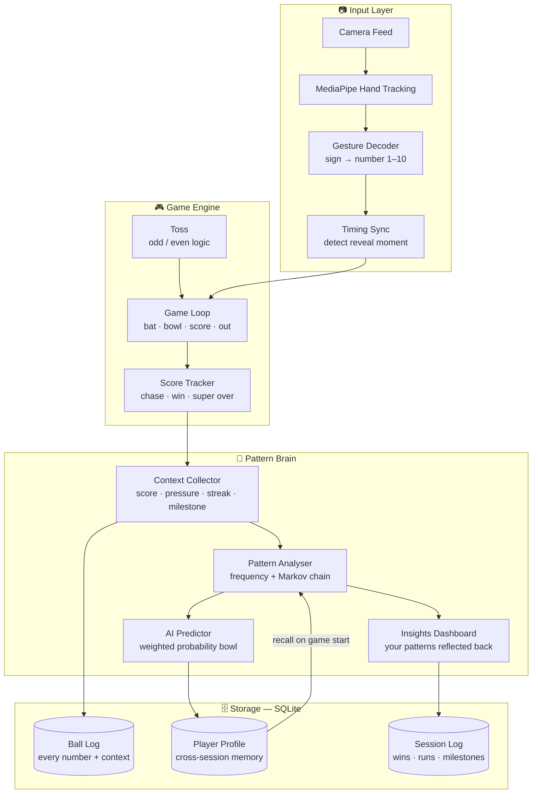

# 🏏 Hand Cricket AI

> *A passion project at the intersection of a schoolyard game, human psychology, and machine learning.*

Hand Cricket is a hand-sign based batting game invented by high schoolers around 2019. Two players reveal numbers 1–10 simultaneously using hand signs — same number means the batter is out. Simple rules, endlessly complex human behaviour underneath.

This project builds an AI that **plays the game, watches you play, and learns how predictable you really are.**

---

## What This Is

On the surface: a web app where you play Hand Cricket against an AI using your webcam.

Under the surface: a **behavioural pattern recognition engine** that tracks every number you throw, the context you threw it in, and uses that data to bowl against you more intelligently over time.

The core thesis of this project is simple —

> *"Given enough balls, every player becomes predictable — even the ones who think they aren't."*

Humans don't truly randomise. They have favourite numbers, pressure responses, streak behaviours, and ego-driven patterns. This app finds yours.

---

## How Hand Cricket Works

**The Toss** — One player calls odd or even. Both reveal a number. Sum decides the winner.

**Batting phase** — Batter and bowler reveal numbers simultaneously using hand signs. Same number = batter is OUT. Different number = batter scores those runs. Continues until out.

**Chasing phase** — Second player targets first player's score + 1. Same rules apply. Gets out before target = first player wins. Reaches target = chaser wins.

**Super over** — If scores are tied, 6 ball sudden death round.

**Hand signs used:**

| Number | Sign |
|--------|------|
| 1 | Index finger up |
| 2 | Index + middle |
| 3 | Index + middle + ring |
| 4 | Index + middle + ring + pinky |
| 5 | Open palm (non-overlapping clap) |
| 6 | Thumbs up 👍 |
| 7 | Thumb + index |
| 8 | Thumb + index + middle |
| 9 | Thumb + index + middle + ring |
| 10 | Namaste / prayer hands 🙏 |

---

## Architecture

---

## What The AI Tracks

Every single ball is logged with full context:

- The number thrown
- Current score at that moment
- Match state — normal / last 3 balls / super over / last ball
- Score bracket — 0–50 / 50–100 / 100–150 / 150+
- Streak length of current number
- Whether batting first or chasing

From this, the pattern brain builds a **probability table per player** that updates in real time. The AI bowls the number it thinks you're most likely to throw.

---

## Insights The App Shows You

**Predictability Score** — A single number showing how well the AI has modelled you. Updates every ball. Lower is better. Try to fool it.

**Pressure Heatmap** — A grid of score brackets vs numbers showing exactly where your behaviour shifts under pressure.

**Number Distribution** — Bar chart of how often you throw each number. Your giveaway numbers highlighted in red.

**First Ball Tendency** — Your most common opening number across all sessions. Quietly the most damning stat.

---

## Tech Stack — 100% Free & Open Source

| Layer | Technology |
|-------|-----------|
| Gesture recognition | MediaPipe (Google, open source) |
| Backend + game logic | Python + FastAPI |
| Pattern brain | NumPy + Markov chain logic |
| Database | SQLite (local, zero setup) |
| Web frontend | React + TailwindCSS |
| Mobile (V2) | Flutter |
| Hosting (later) | Railway / Render free tier |

---

## Build Roadmap

- [ ] **Phase 1** — Game engine (pure Python, terminal playable)
- [ ] **Phase 2** — Pattern brain + SQLite data layer
- [ ] **Phase 3** — Web UI + MediaPipe webcam integration
- [ ] **Phase 4** — Connect all modules, test, polish
- [ ] **Phase 5 (V2)** — Mobile app via Flutter
- [ ] **Phase 6 (V2)** — Custom hand signs per player
- [ ] **Phase 7 (V2)** — AI batting strategy

---

## Why This Exists

This game has history. It was born in high school corridors around 2019, spread fast, survived COVID, and came back. Thousands of balls have been bowled with zero data collected.

This project changes that. It's part game, part experiment, part mirror — built to answer one question:

**Do you actually play randomly, or do you just think you do?**

---

*Built with curiosity. Powered by probability. Inspired by boring physics lectures.*
